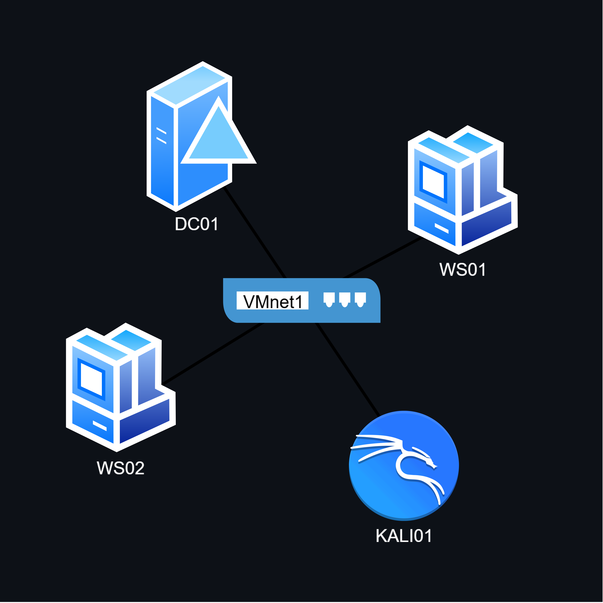

---

# ACTIVE DIRECTORY LAB

A hands-on Active Directory security lab demonstrating practical IT and security skills.

Scenario: a fictional law firm running Windows Server 2025 and Windows 11 workstations on an isolated VMware network.

---

### Environment

| VM     | Role                   | OS                  | Address          | Assignment |
|--------|------------------------|---------------------|------------------|------------|
| DC01   | Domain controller, DNS | Windows Server 2025 | 192.168.190.10   | Static     |
| WS01   | Domain workstation     | Windows 11          | 192.168.190.128  | DHCP       |
| WS02   | Domain workstation     | Windows 11          | 192.168.190.129  | DHCP       |
| KALI01 | Attacker               | Kali Linux          | 192.168.190.11   | Static     |

Domain: ad.pearsonspecterlitt.com (PSL)

Network: VMware host-only (VMnet1), no external routes

---

### What was built

- Windows Server 2025 domain controller promoted from scratch.
- OU structure based on departments: Legal, Administration,
  Finance-Billing, IT.
- 8 user accounts, security groups, and scoped IT delegation
  (password reset and unlock without full admin rights).
- Account lockout policy with delegated unlock validation.
- Targeted audit GPOs on DC01 and WS01 separately.

---

## Security scenarios

### Scenario 1: SMB share over-permission
[`docs/2026-09-09 log.txt`](docs/2026-09-09%20log.txt), [`docs/2026-09-11 log.txt`](docs/2026-09-11%20log.txt)

The PSL-Support-Private share on WS01 granted read access to
Domain Users. An associate account (kbennett) with no support
role connected from KALI01 and read a mock confidential file.

**Evidence:** Events 4624 and 5145 on WS01

**Fix:** Revoked Domain Users from share and NTFS permissions

**Verified:** kbennett receives ACCESS_DENIED while the support group
retains access

### Scenario 2: AS-REP roasting
[`docs/2026-09-13.txt`](docs/2026-09-13.txt)

A dedicated test account was created with Kerberos
preauthentication disabled. Impacket's GetNPUsers captured the encrypted
AS-REP hash without credentials. Hashcat cracked it offline.

**Evidence:** Events 4738 (flag change) and 4768 (AS-REP issued)

**Fix:** Re-enabled preauthentication, reset password

**Verified:** GetNPUsers can no longer capture a hash

### Scenario 3: Excessive local administrator access
[`docs/2026-09-14.txt`](docs/2026-09-14.txt)

An associate (kbennett) was a member of WS01's local
Administrators group. She connected from Kali01 via NTLM and
authenticated to C$.

**Evidence:** Events 4624 (logon) and 4733 (removal)

**Fix:** Removed kbennett from local Administrators

**Verified:** C$ access returns NT_STATUS_ACCESS_DENIED

---

### Build logs

All sessions are in [`docs/`](docs/). Each file contains timestamps,
commands, real output, dead ends, and the reasoning behind
decisions - not a clean walkthrough written from memory.

---

 

*Fictional firm, Suits-inspired naming. Stated here to avoid ambiguity.*

